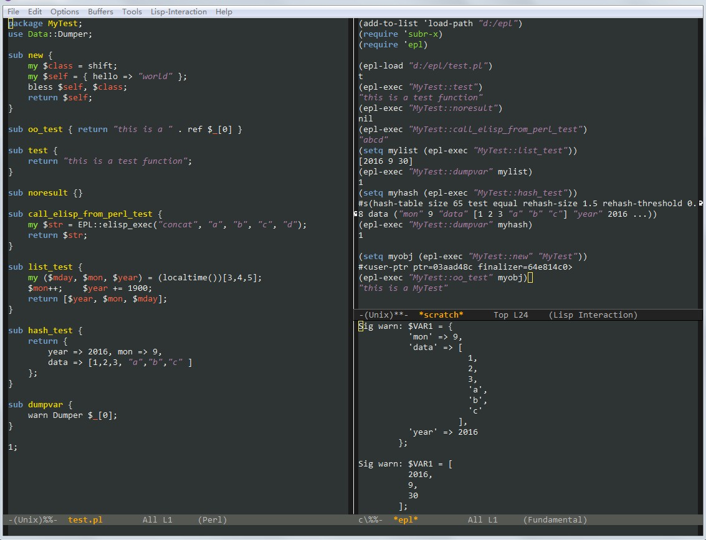

# epl v0.15
**use perl interpreter in Emacs dynamic module**

- call perl function from elisp
- call elisp function from perl


## Setup
Require Emacs version > 25 and compiled with '--with-modules',
Need to compile Emacs for windows also, official pre-compiled version doesn't enable this option.

### Modify emacs src for Linux/Unix, windows is fine
emacs-src/src/dynlib.c about line 276 (in function dynlib_open):
```
 return dlopen (path, RTLD_LAZY);
 change to:
 return dlopen (path, RTLD_LAZY|RTLD_GLOBAL);
```
otherwise can't load perl XS module.

### Compile epl
Enter epl directory,
on *nix, execute make,

on Windows need to install strawberryperl then execute gmake

### load
```
(add-to-list 'load-path "path/to/epl")
(require 'subr-x);; yes, need this.
(require 'epl)
```
If everything goes fine, it will load init.pl under epl directory,
you can add your code in init.pl or use elisp to load other perl script.

### Usage
- (epl-load "perl/code/file") ;;load a perl script/package
- (epl-exec "MyMod::myfunc" "args1" ...) ;;execute a perl function
- EPL::elisp_exec( "elispFunction" "args1" ...) #execute elisp function from perl
- EPL::log(...) #write log to emacs buffer "*epl*"

### Data type conversion
- Elisp string/integer/float <-> perl scalar
- Elisp vector <-> perl array ref
- Elisp hash-table <-> perl hash ref
- Elisp nil <-> perl undef
- Elisp t -> perl int 1
- Empty perl array ref and hash ref will be converted to elisp nil
- Perl blessed object can be returned to elisp and can be passed to perl function later

### Limitation
- only support Elisp string, integer, float, vector, hash-table, nil, t
- perl function should return at most one value

### Problems
- perl operation maybe interrupted by emacs without GUI, for example: sleep(99), move cursor can interrupt sleep,
if you want to use DBI, it may have problem.
- On Windows @INC maybe empty, if that happen, you can add it with BEGIN{} in init.pl

### Warning
This software is not stable, it may lead emacs crash and lost un-saved content in buffer!

### TODO
may be need function like epl-destroy or epl-reload-perl to recreate perl interpreter.

### Reference
- emacs-mruby-test (https://github.com/syohex/emacs-mruby-test).
- weechat (https://weechat.org/) a great IRC client.

